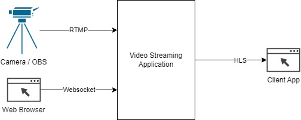
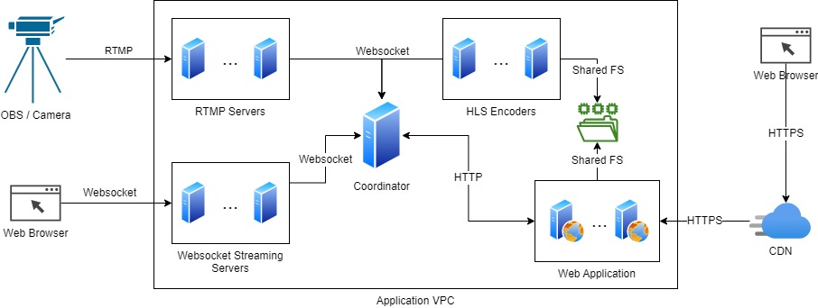

# Tools for video streaming over TCP

This repository is a collection of tools to implement video streaming features over TCP protocol.

When streaming video over TCP, you can preserve the quality. However, a delay is expected and possibly loading times if the user connection is slow. Possibly use cases of this are live streaming services like YouTube or Twitch, live TV services or any other similar services.

## Supported protocols

For sending the video stream:

- RTMP (Real Time Messaging Protocol)
- WebSocket

The RTMP protocol is widely supported by broadcasting tools like OBS, while the Websocket protocol allows the broadcasting from web browsers.

For receiving the video stream:

- HLS (HTTP Live Streaming)

Currently, HLS (HTTP Live Streaming) is widely supported by almost all web browsers, natively or with MSE (Media Source Extensions). Check this library to support it in your web client: [hls.js](https://github.com/video-dev/hls.js/).

The video streaming application will accept different broadcasting protocols depending on the client capabilities, encoding the stream into HLS for playback and resizing it into multiple resolutions and frame rates for different connection speeds. It may also record the video stream for serving video on demand.



## List of tools

- [RTMP Server](./rtmp-server): This component supports the RTMP protocol and it is meant for clients to connect and broadcast the video stream using such protocol.
- [Websocket Stream Server](./ws-stream-server): This component allows web browsers to open a Websocket and send video chunks as messages. This is necessary for Web Browser broadcasting compatibility, since a web page cannot open raw TPC connections required for the RTMP protocol.
- [Coordinator](./coordinator): This component coordinates the other components and communicates with the rest of the application, allowing it to authorize or deny broadcasting requests and to force stop any active video streams.
- [HLS Encoder](./hls-encoder): This component encodes video streams to HLS and resizes them to multiple resolutions and frame rates.

Every component connects to the coordinator via Websocket, and the coordinator will communicate with the web application via HTTP requests.

The HLS encoders will save the files into a file system you can configure to be shared between the encoders and the web application servers, so the servers can access the HLS files as soon as they are created to serve them to the clients.

It is recommended to also use a content delivery network (CDN) service in order to reduce latency when broadcasting to multiple countries.

For scalability, every component, except for the coordinator can be horizontally scaled. It is recommended to at least scale the HLS encoders, since they are the most resource-intensive components.



## Docker

There is a Docker image available in [Docker Hub](https://hub.docker.com/r/asanrom/tcp-video-streaming) with all the tools of this project.

In order to pull the image, type:

```sh
docker pull asanrom/tcp-video-streaming
```

You can run the image specifying the tool you want to run in the `command` option of `docker run`:

| Command            | Tool ro run                                   |
| ------------------ | --------------------------------------------- |
| `coordinator`      | [Coordinator](./coordinator)                  |
| `hls-encoder`      | [HLS Encoder](./hls-encoder)                  |
| `rtmp-server`      | [RTMP Server](./rtmp-server)                  |
| `ws-stream-server` | [Websocket Stream Server](./ws-stream-server) |

Check the README file of each tool in order to know the available configuration variables for them.

[View docker compose example](./test-app/docker-compose.yml)

## Documentation

- [Coordinator HTTP API specification](./doc/API.md)
- [Internal coordinator protocol](./doc/PROC.md)
- [Streaming files structure](./doc/FILES.md)

Also check the README of every component for component-specific documentation.

## Testing

You can locally test the tools with Docker using the [Streaming Test Application](./test-app/), provided in this repository.

## License

This project is under the [MIT](./LICENSE) license.
